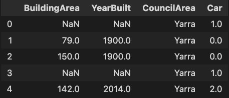

# autofill


<p align="center">
  
</p>

autofill is a module for analyzing and imputing missing values in a pandas dataframe. 

For a specific column, autofill will split the data, fit the imputing techniques and evaluate its fit on the test-sample.

### Installation

```bash
pip install autofill
```

### Example usage
```python
import pandas as pd
from autofill.engine import AutoFill

df = pd.read_csv("melb_data.csv")
auto_fill = AutoFill()
auto_fill.missing_analysis(df)

```


### Running tests

To run the unit tests, simply:

```bash
python -m pytest
```
